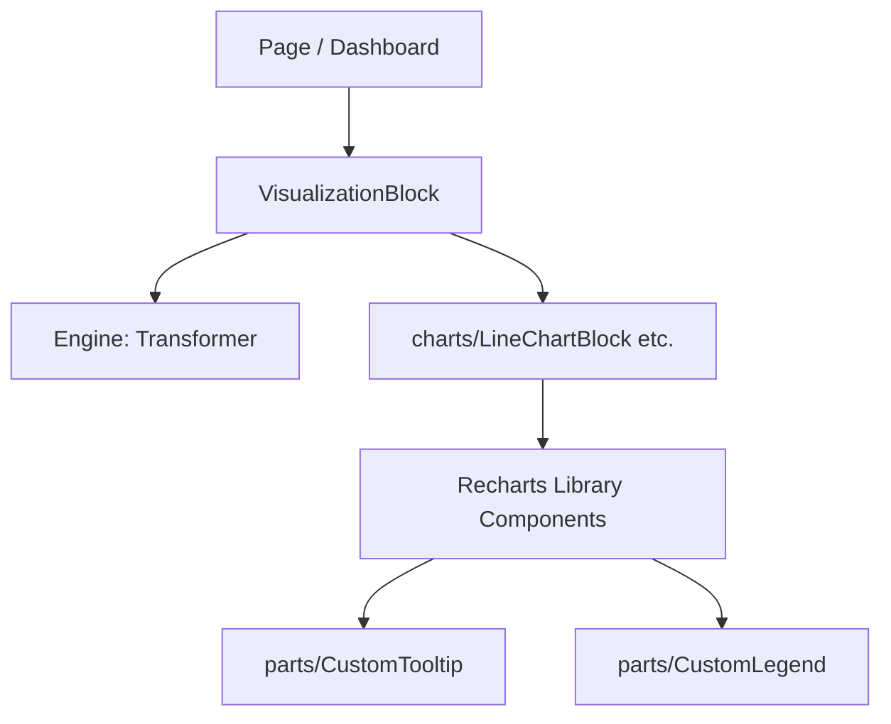

# Analytics Components Detailed Specifications

## 1. Overview
Analytics Components are responsible for receiving `RechartsProps` from the engine's Transformers and rendering them as functional UI elements.
Instead of using Recharts' default styles, these components integrate **Shadcn/UI** and **Tailwind CSS** to match the application's overall design aesthetic.

**Note for Agents:** Individual specifications for specific UI components can be found by traversing this directory: `@docs/module-definition/analytics/components/**`.

## 2. Directory & Naming Conventions

```
src/features/analytics/components/
├── VisualizationBlock.tsx # Main entry point (Container)
├── charts/                # Implementations per chart type
│   ├── LineChartBlock.tsx
│   ├── BarChartBlock.tsx
│   └── PieChartBlock.tsx
└── parts/                 # Reusable, styled chart elements
    ├── CustomTooltip.tsx  # Based on Shadcn/UI Card
    ├── CustomLegend.tsx   # Styled with Tailwind CSS
    └── CustomAxis.tsx     # Common definitions for fonts and colors
```

### Naming Rules
*   **File Name:** PascalCase. Main chart blocks follow the pattern `[Type]ChartBlock.tsx`.
*   **Component Name:** Must match the file name.

## 3. Component Hierarchy



## 4. Design Strategy

*   **No Defaults:** Recharts' default tooltips and legends must be completely overridden using the `content` property.
*   **Shadcn/UI Integration:**
    *   Tooltips should be implemented using the Shadcn/UI `Card` component for a modern look.
    *   Color schemes should prioritize the `color` property from the `series` config while remaining harmonious with the app's theme.
*   **Responsiveness:** All chart components must be wrapped in Recharts' `ResponsiveContainer` to automatically adjust to the size of their parent container (e.g., a Dashboard Block).

## 5. Extension Guide (For Agents)

To add a new chart type (e.g., Scatter Chart):
1.  **Create Component:** Add `ScatterChartBlock.tsx` in the `charts/` directory.
2.  **Apply Components:** Inject styled components from `parts/` (like `CustomTooltip`) to ensure visual consistency with existing charts.
3.  **Update Entry Point:** Add the new chart type to the selection logic (e.g., `switch` statement) within `VisualizationBlock.tsx`.

## 6. TDD Test Requirements
*   **Rendering Verification:** Ensure that the correct number of data points (SVG elements, etc.) are rendered based on the provided data.
*   **Loading & Error States:** Verify that fallback UI is displayed correctly during data fetching or upon API failure.
*   **Responsive Behavior:** Confirm that the chart re-renders and resizes correctly when the container dimensions change.
