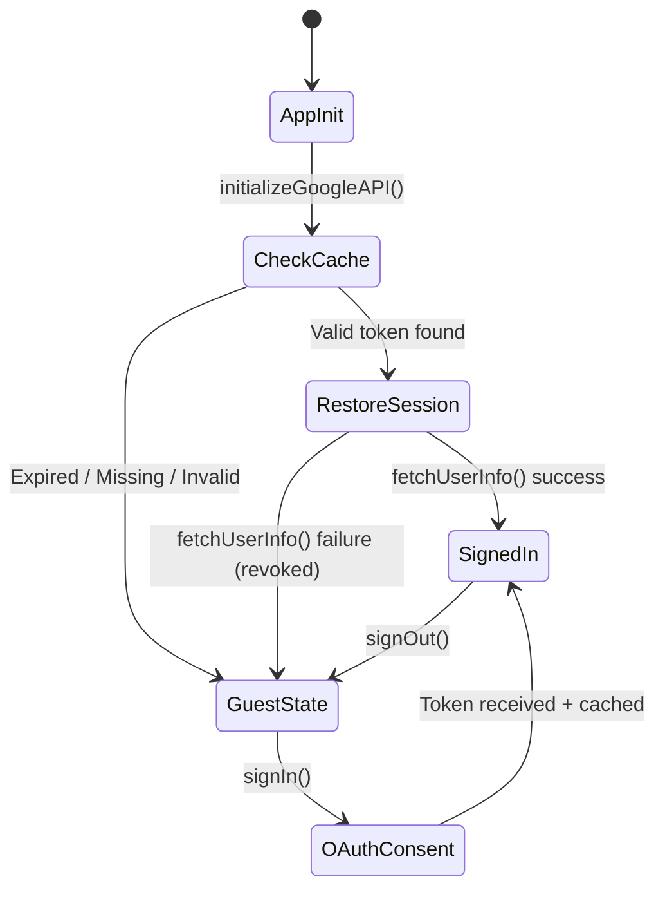

# Auth Module Specifications

## 1. Overview
The Auth module is responsible for Google OAuth2 authentication, token lifecycle management, and session persistence via LocalStorage caching.
By caching the access token locally, the module enables automatic session restoration on app startup, eliminating repeated login prompts and improving user experience.

## 2. Architecture & Responsibility

### 2.1 Scope
*   **Protocol:** Google OAuth2 (Google Identity Services Token Model).
*   **App Type:** SPA (Single Page Application) — no server-side component; all token handling occurs in the browser.
*   **Security Boundary:** Tokens are stored in `LocalStorage`. The module does not handle `Client Secret` (not applicable for SPA).

### 2.2 Dependencies
*   **Google API Client Library (gapi):** Used for API discovery and setting the access token for Google Sheets API calls.
*   **Google Identity Services (GIS):** Used for initiating the OAuth consent flow and obtaining access tokens.

## 3. Data Model

### 3.1 TokenData
```typescript
interface TokenData {
  accessToken: string;   // OAuth2 access token (e.g., "ya29.a0...")
  expiresAt: number;     // Expiration timestamp in milliseconds (Date.now() + expires_in * 1000)
}
```

*   **Storage Key:** `google_auth_token`
*   **Storage Location:** `LocalStorage`
*   **Format:** JSON string

### 3.2 AuthState
```typescript
interface AuthState {
  isSignedIn: boolean;
  user: {
    email: string;
    name: string;
    picture?: string;
  } | null;
}
```

## 4. Token Lifecycle



### 4.1 Login (Token Acquisition & Caching)
1.  User clicks "Sign in with Google".
2.  `signIn()` initiates the OAuth consent flow via GIS `tokenClient.requestAccessToken()`.
3.  On success, the callback receives the OAuth response containing `access_token` and `expires_in`.
4.  The token is set on `gapi.client` for API calls.
5.  `saveToken()` persists the token to LocalStorage with a calculated `expiresAt` (`Date.now() + expires_in * 1000`).
6.  User info is fetched and `AuthState` is broadcast to listeners.

### 4.2 App Init (Session Restoration)
1.  `initializeGoogleAPI()` loads gapi and GIS.
2.  After GIS initialization, `getToken()` checks LocalStorage for a cached token.
3.  **Valid token:** Set on `gapi.client`, then `fetchUserInfo()` to restore the session.
    *   On success: Broadcast `isSignedIn: true` with user info.
    *   On failure (e.g., token revoked server-side): `clearToken()` and reset `gapi.client`.
4.  **Expired / Missing / Invalid:** No action; user remains in guest state.

### 4.3 Logout (Token Revocation & Cleanup)
1.  `signOut()` calls `google.accounts.oauth2.revoke()` to invalidate the token server-side.
2.  On revoke callback: `gapi.client.setToken(null)` and `clearToken()` removes the token from LocalStorage.
3.  Broadcast `isSignedIn: false` to listeners.

## 5. Public API

### 5.1 Token Cache Functions

| Function | Signature | Description |
| :--- | :--- | :--- |
| `saveToken` | `(tokenData: TokenData) => void` | Persists token data to LocalStorage as JSON. |
| `getToken` | `() => TokenData \| null` | Retrieves cached token. Returns `null` and auto-clears if expired or invalid JSON. |
| `clearToken` | `() => void` | Removes the token from LocalStorage. |
| `isTokenValid` | `() => boolean` | Returns `true` if a valid (non-expired) token exists in cache. |

### 5.2 Authentication Functions

| Function | Signature | Description |
| :--- | :--- | :--- |
| `initializeGoogleAPI` | `() => Promise<void>` | Initializes gapi + GIS. Restores session from cache if valid token exists. |
| `signIn` | `() => Promise<void>` | Initiates OAuth consent flow. Caches token on success. |
| `signOut` | `() => void` | Revokes token, clears cache, and resets auth state. |
| `isSignedIn` | `() => boolean` | Returns `true` if `gapi.client` holds a token. |
| `getAccessToken` | `() => string \| null` | Returns the current access token from `gapi.client`. |

### 5.3 Auth State Subscription

| Function | Signature | Description |
| :--- | :--- | :--- |
| `subscribeToAuthState` | `(listener: (state: AuthState) => void) => () => void` | Registers a listener for auth state changes. Returns an unsubscribe function. |

## 6. Component Structure

```
src/db/adapters/google_sheets/
├── auth.ts         # OAuth2 authentication + token cache management
└── auth.test.ts    # Unit & integration tests for token cache
```

## 7. TDD Test Case Scenarios

### 7.1 saveToken (Unit Test)
*   **[Normal] Persist:** Verify that `accessToken` and `expiresAt` are correctly stored in LocalStorage as JSON.
*   **[Normal] Overwrite:** Verify that calling `saveToken` with new data overwrites the previous entry.

### 7.2 getToken (Unit Test)
*   **[Normal] Retrieve:** Verify that a stored valid token can be retrieved with matching fields.
*   **[Normal] Missing:** Verify that `null` is returned when no token exists.
*   **[Edge] Expired:** Verify that an expired token returns `null` and is automatically cleared from LocalStorage.
*   **[Edge] Invalid JSON:** Verify that corrupted data returns `null` and is automatically cleared.

### 7.3 clearToken (Unit Test)
*   **[Normal] Remove:** Verify that the token is removed from LocalStorage after calling `clearToken`.
*   **[Edge] No-op:** Verify that calling `clearToken` when no token exists does not throw.

### 7.4 isTokenValid (Unit Test)
*   **[Normal] Valid:** Verify that `true` is returned when a non-expired token is cached.
*   **[Normal] Expired:** Verify that `false` is returned when the token is past its `expiresAt`.
*   **[Normal] Missing:** Verify that `false` is returned when no token is cached.

### 7.5 Token Lifecycle (Integration Test)
*   **[Critical] Full Flow:** Verify the Login → Session Restore → Logout sequence works end-to-end.
*   **[Critical] Auto-Cleanup:** Verify that expired tokens are automatically cleared when accessed via `getToken`.
