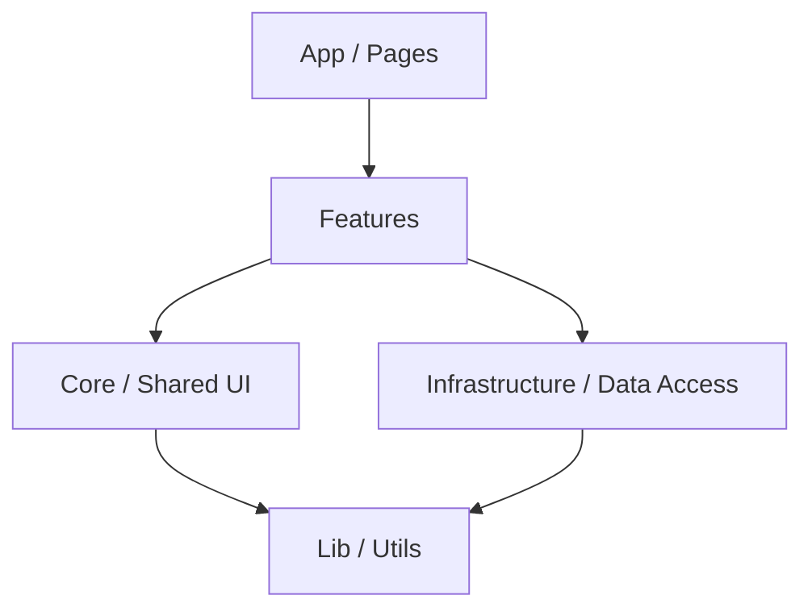

# Module Definition Overview

## 1. Architecture Strategy
BodyAnalyst adopts a **Feature-Based Modular Architecture**.
Instead of grouping files solely by technical role (e.g., all components in one folder, all hooks in another), we group code by **Domain Feature**. This ensures that related logic, UI, and state management for a specific feature (like "Workout" or "Meals") co-locate, improving maintainability and scalability.

## 2. Layered Structure

The application is structured into four primary layers, with dependencies flowing **downwards**.

1.  **App / Pages (`src/pages`, `src/App.tsx`)**
    *   **Role:** The entry point and composition layer. It handles routing and composes Features to build complete screens.
    *   **Responsibility:** Routing, Layouts, Global Providers.

2.  **Features (`src/features/*`)**
    *   **Role:** The core business logic and UI for specific domains.
    *   **Responsibility:** Each feature module (e.g., `workout`, `meal`) contains its own components, hooks, and local state.

3.  **Core / Shared UI (`src/components/common`, `src/hooks`)**
    *   **Role:** Reusable, domain-agnostic building blocks.
    *   **Responsibility:** Design System components (Buttons, Inputs), generic hooks (useToggle, useWindowSize).

4.  **Infrastructure (`src/db`, `src/services`)**
    *   **Role:** Data persistence and external system communication.
    *   **Responsibility:** Google Sheets API integration, Repository implementations, Data Adapters.

## 3. Module List

### Domain Feature Modules
These modules encapsulate the core functionalities of the application.

| Module Name | Directory | Description | Key Responsibilities |
| :--- | :--- | :--- | :--- |
| **Dashboard** | `features/dashboard` | The customizable home screen. | Grid layout management, Block rendering, Widget configuration. |
| **Analytics** | `features/analytics` | Data visualization engine. | Chart rendering (Recharts wrapper), Data transformation logic. |
| **Workout** | `features/workout` | Training management. | Logging sessions, Exercise master management, 1RM calculation. |
| **Meal** | `features/meal` | Nutrition management. | Food search, Meal logging, PFC calculation. |
| **Weight** | `features/weight` | Body composition. | Weight/Fat entry, Trend analysis. |
| **Settings** | `features/settings` | User preferences. | App configuration, Profile management. |

### Infrastructure Modules
These modules handle data I/O.

| Module Name | Directory | Description | Key Responsibilities |
| :--- | :--- | :--- | :--- |
| **Storage** | `db/storage` | Google Sheets Adapter. | Raw API communication, OAuth token management. |
| **Repositories** | `db/repositories` | Typed Data Access. | Converting raw sheet rows to Domain Entities (e.g., `WorkoutRepository`). |

## 4. Module Boundary Rules

1.  **Feature Isolation:**
    *   Features should **not** import directly from other Features.
    *   *Exception:* `Dashboard` may import components from other features to render widgets, but strict interfaces should be defined.
    *   Shared logic between features should be promoted to `Core` or `Lib`.

2.  **Unidirectional Dependency:**
    *   `Features` can depend on `Core` and `Infrastructure`.
    *   `Core` and `Infrastructure` must **never** depend on `Features`.

3.  **Public API:**
    *   Each module should expose a clean `index.ts` defining its public API. Internal implementation details should remain private.
