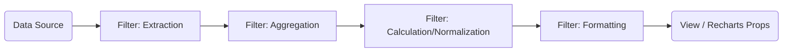

# Visualization Engine Specifications

## 1. Overview
The Visualization Engine is the core module responsible for the flexible processing, calculation, and visualization of all data within the application.
Extending beyond simple data transformation, it adopts a **Pipe & Filter Architecture** to enable user-defined calculations (e.g., weight ratios, moving averages) and complex data processing workflows.

## 2. Architecture (Pipe & Filter)

Data processing is modeled as a sequence (Pipeline) of independent "Filters".



### 2.1 Key Components

1.  **Source (Extractor)**
    *   Retrieves raw data from domain-specific repositories and converts it into a common data format (Canonical Data Model) for the pipeline.
    *   Examples: `WeightSource`, `WorkoutSource`

2.  **Filter (Processor)**
    *   An independent processing unit that accepts input data, transforms it, and outputs the result.
    *   **Data Manipulation:** Time range filtering, missing value handling.
    *   **Aggregation:** Daily, weekly, or monthly grouping.
    *   **Arithmetic:**
        *   `OperationFilter`: Arithmetic operations between fields (e.g., `bench_press_weight` / `body_weight`).
        *   `TrendFilter`: Calculation of moving averages or trend lines.
    *   **Formatting:** Unit conversion, string generation for display.

3.  **Pipeline Engine**
    *   A runner that instantiates the Source and a sequence of Filters based on a configuration (Config) and executes the data processing flow.

4.  **Sink (Presenter)**
    *   Converts the processed data into the final consumption format (e.g., Recharts Props).

## 3. Data Model

Data flowing through the pipeline uses a normalized dictionary structure to prevent dependencies between modules.

```typescript
// A single record in the pipeline
interface DataPoint {
  timestamp: number; // Unique key representing time
  attributes: {
    [key: string]: number | string | null; // Dynamic fields (weight, volume, etc.)
  };
  metadata?: any; // Origin information, etc.
}

// The entire dataset
type DataFrame = DataPoint[];
```

## 4. Arithmetic Capabilities

To fulfill requirements such as "viewing bench press weight divided by body weight," the engine provides standard calculation features.

### 4.1 Field Operation Filter
Performs operations between existing fields or with constants to generate (or overwrite) a field.

*   **Config Example:**
    ```json
    {
      "type": "arithmetic",
      "targetField": "relative_strength",
      "operation": "divide",
      "operandA": "bench_press_1rm",
      "operandB": "body_weight"
    }
    ```

### 4.2 Time-Series Operation Filter
Performs calculations along the time axis.

*   **Moving Average:** Calculates the average over a specified window size.
*   **Cumulative:** Calculates the cumulative value from the starting point.

## 5. Configuration Persistence

Custom charts created by users are saved as **Pipeline Configurations** in JSON format.

*   This ensures complete reproducibility of "what data" was used, "how it was processed," and "how it is displayed."
*   Presets (recommended charts) are also provided in this JSON format.

## 6. Implementation Plan

The existing `Transformer` in the `Analytics` module will be redefined and refactored as a type of `Filter` within this architecture.

1.  **Core Interface Definition:** Define interfaces for `Source`, `Filter`, and `Pipeline`.
2.  **Base Filters Implementation:** Migrate range filters and aggregation filters.
3.  **Arithmetic Filters Implementation:** Implement new calculation logic.
4.  **UI Integration:** Logic to generate Configs from the chart settings UI.