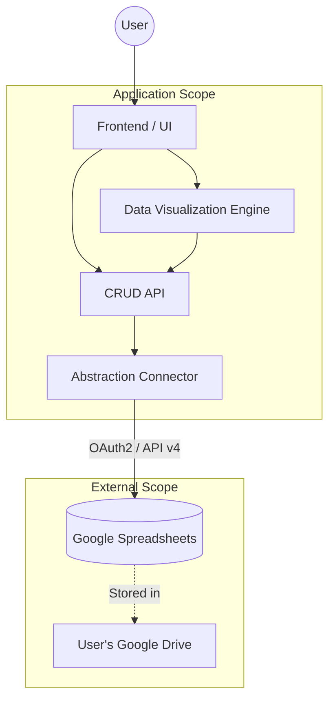

# System Architecture Specifications

## System Overview
The system follows a strict layered architecture to ensure separation of concerns and maintainability.
Each layer depends only on the layers directly below it.

### Layered Architecture

1.  **Frontend (Presentation Layer):**
    *   The user interface built with React.js.
    *   Handles user interactions and displays data using the Visualization Engine.
    *   PWA capabilities powered by Vite.

2.  **Data Visualization Engine:**
    *   [Detailed Specifications](../visualization_engine/SPECIFICATIONS.md)
    *   A specialized component layer responsible for transforming raw data into visual formats (charts, graphs).
    *   Consumed by the Frontend.

3.  **CRUD API (Service Layer):**
    *   Provides domain-specific operations (Create, Read, Update, Delete) to the upper layers.
    *   Abstracts the complexity of data manipulation.

4.  **Abstraction Connector (Data Access Layer):**
    *   Acts as a bridge between the application logic and the external data source.
    *   Handles the specific implementation details of the Google Sheets API.
    *   Manages authentication tokens (OAuth2).

5.  **Database (Data Source):**
    *   **Google Sheets:** Stored within the user's personal Google Drive.
    *   Users own their data completely.

### Architecture Diagram

## Data Management
*   **Storage:** Data is persisted exclusively in Google Spreadsheets located in the user's private Google Drive.
*   **Ownership:** The application does not store user data on its own backend servers; users retain full ownership and control.

## Authentication
*   **Protocol:** Google OAuth 2.0.
*   **Mechanism:** Users authorize the application to access their Google Drive/Sheets scope.

## Technology Stack
*   **Core Framework:** React.js
*   **Language:** TypeScript
*   **Build Tool & PWA:** Vite (with PWA plugin)
*   **Deployment:** Vercel (Hobby/Free Tier)
