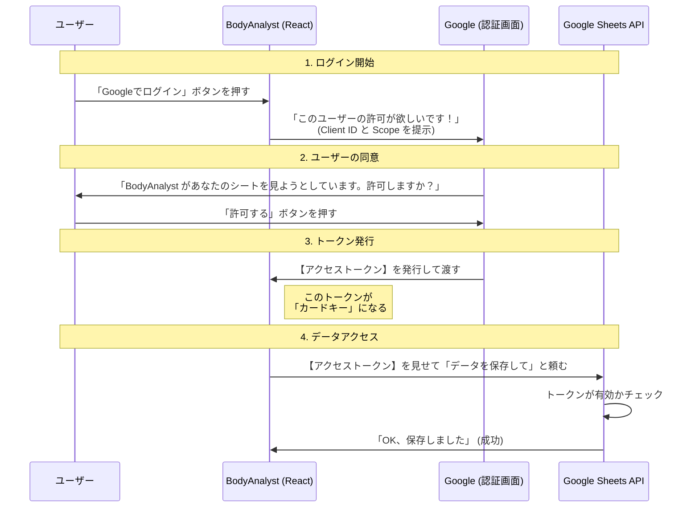

# OAuth 2.0 (オーオース 2.0) 認証・認可の仕組み解説

## 1. はじめに：OAuth 2.0 とは？

OAuth 2.0 は、アプリがユーザーの代わりに**「特定のデータ」にアクセスする許可をもらうための仕組み**です。

BodyAnalyst のケースで言うと、以下の目的のために使用します。
> 「BodyAnalyst というアプリが、ユーザー（あなた）のパスワードを知ることなく、あなたの Google ドライブにあるスプレッドシートを読み書きする許可をもらう」

### わかりやすい例え：ホテルのカードキー
OAuth の仕組みは「ホテルのチェックイン」によく似ています。

*   **ユーザー（あなた）:** ホテルの宿泊客。
*   **Google (認証サーバー):** ホテルのフロント。
*   **BodyAnalyst (アプリ):** あなたが雇った清掃員（特定の部屋に入りたい人）。
*   **パスワード:** あなたの身分証明書や自宅の実印（**絶対に他人に渡してはいけないもの**）。
*   **アクセストークン:** ホテルの**カードキー**。

あなたは清掃員（アプリ）に、実印（パスワード）を預けたりしません。
その代わり、フロント（Google）に行って**「この人に期間限定で、私の部屋（スプレッドシート）だけに入れるカードキー（トークン）を発行してください」**と依頼します。
これが OAuth です。

---

## 2. 登場人物と役割

| 用語 | 役割 | BodyAnalyst での具体例 |
| :--- | :--- | :--- |
| **Resource Owner** (リソース所有者) | データの持ち主。許可を出す人。 | **ユーザー（あなた）** |
| **Client** (クライアント) | データを使いたいアプリ。 | **BodyAnalyst (Webアプリ)** |
| **Authorization Server** (認可サーバー) | 許可証を発行する管理者。 | **Google の認証システム** |
| **Resource Server** (リソースサーバー) | データが置いてある場所。 | **Google Sheets API** |

---

## 3. 認証の流れ (SPA: Single Page Application の場合)

BodyAnalyst はサーバーを持たない React アプリなので、**Implicit Flow (インプリシットフロー)** あるいは現在は推奨される **Google Identity Services (Token Model)** という手順を使います。

---

## 4. 重要なキーワード解説

### Client ID (クライアントID)
*   **「アプリの名札」**です。
*   Google に「私は BodyAnalyst です」と名乗るための公開IDです。
*   これはソースコードに含まれても問題ありません。

### Client Secret (クライアントシークレット)
*   **「アプリのパスワード」**です。
*   **重要:** BodyAnalyst のようなブラウザだけで動くアプリ（SPA）では、**使いません**（または使いようがありません）。
*   ブラウザ上のコードは誰でも見ることができるため、秘密鍵を持たせることができないからです。

### Scope (スコープ)
*   **「権限の範囲」**です。カードキーでどこまで入れるか指定します。
*   例：
    *   `.../auth/spreadsheets` : 読み書きOK（マスターキーに近い）
    *   `.../auth/spreadsheets.readonly` : 見るだけOK

### Access Token (アクセストークン)
*   **「有効期限付きのパス」**です。
*   API を利用するたびに、これを提示します。
*   Google の場合、SPA向けのトークンは通常 **1時間** で有効期限が切れます。
    *   切れたら、もう一度Googleに問い合わせて再発行してもらいます（ユーザーが再度「許可」を押す必要はなく、裏側で行われることが多いです）。

---

## 5. BodyAnalyst での実装ポイント

### セキュリティ上の注意
今回作成した「Google Cloud Console」の設定で、以下の制限をかけました。これがセキュリティの要です。

1.  **承認済みの JavaScript 生成元:**
    *   `http://localhost:5173` からのリクエストしか受け付けない設定にしました。
    *   これにより、偽のサイトが勝手にあなたの Client ID を使ってログインしようとしても、Google がブロックしてくれます。

### 実際に使うライブラリ
React アプリで Google OAuth を実装する場合、Google 公式のライブラリを使用するのが一般的です。

*   **ライブラリ名:** `@react-oauth/google` または Google Identity Services SDK (GIS)
*   **やること:**
    1.  `GoogleOAuthProvider` でアプリ全体を囲む。
    2.  取得した `Client ID` を設定する。
    3.  ログインボタンを押したときに `useGoogleLogin` フックを使ってトークンを取得する。
    4.  取得したトークンを、Google Sheets API へのリクエストヘッダー (`Authorization: Bearer <トークン>`) に付けて送る。

---

## 6. まとめ

*   OAuth 2.0 は、パスワードを預けずに「権限」だけを貸し借りする安全な仕組み。
*   BodyAnalyst は「Client ID」を使って Google にユーザーの本人確認と許可依頼を行う。
*   手に入れた「アクセストークン」を使って、スプレッドシートを操作する。
